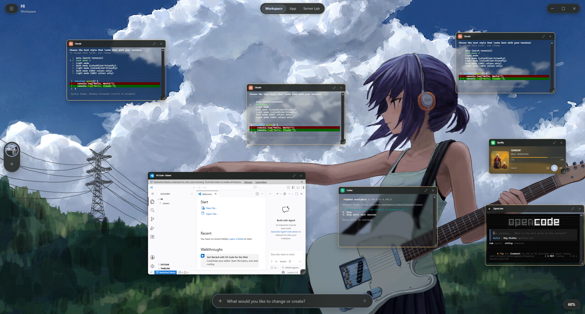
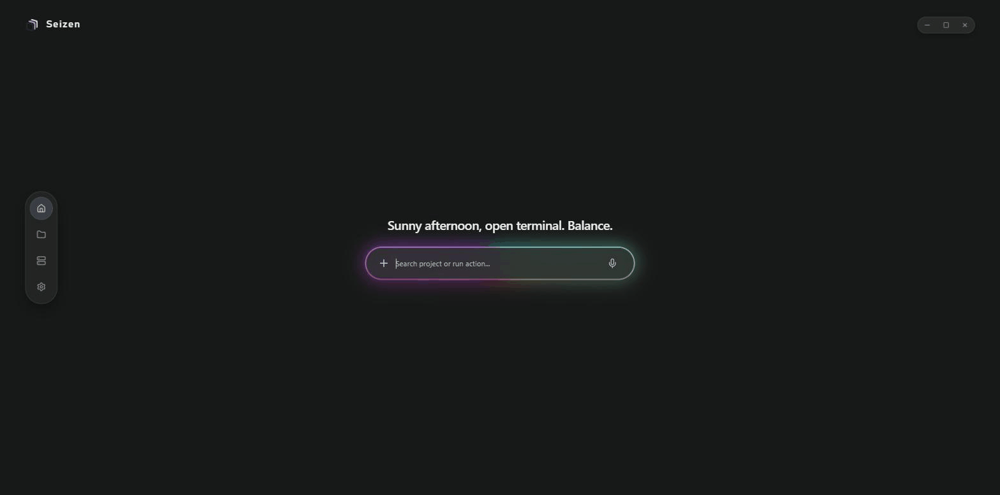
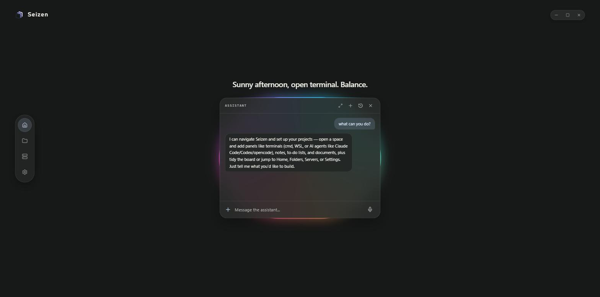
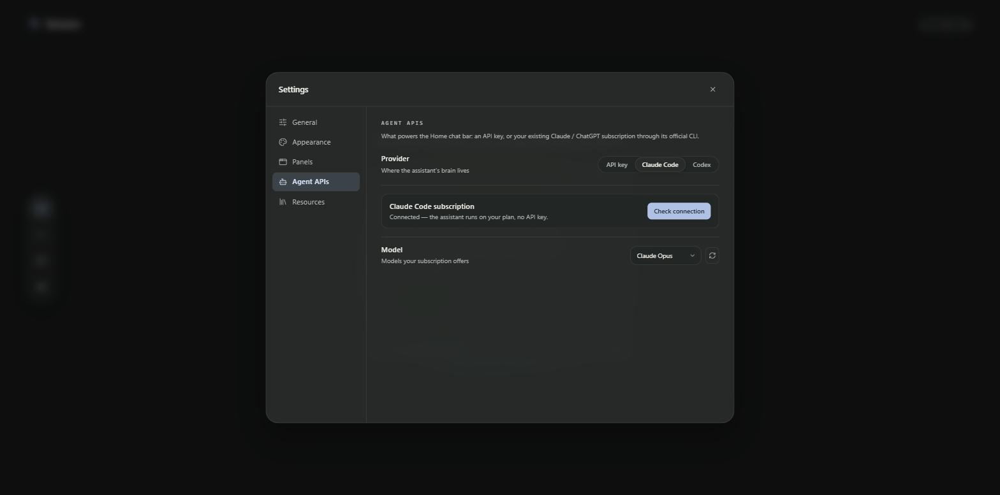
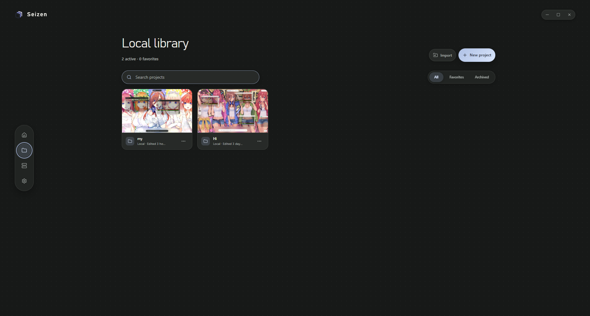
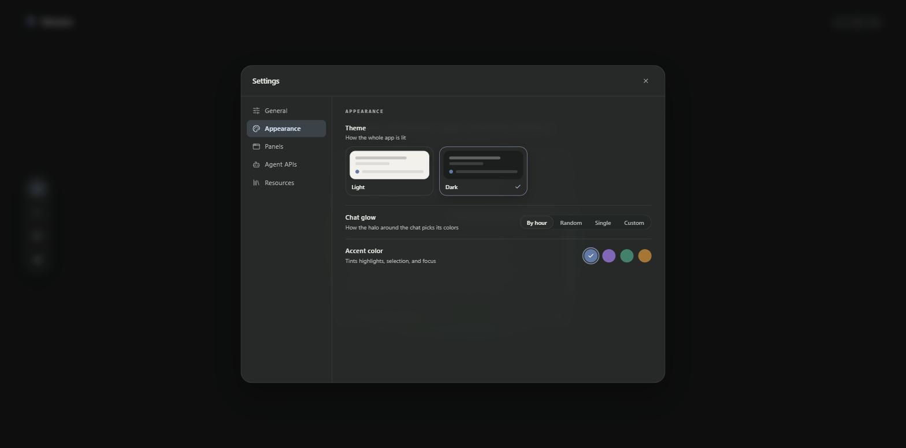

<div align="center">


# Seizen

### Your projects, your agents, your tools — one canvas. A desktop workspace where AI terminals, code editors, and browsers live together as movable panels, with an assistant that runs the whole thing.


</div>

<div align="center">
  
</div>

---

## What is it?

Seizen turns every project into a **workspace canvas**. Drop in what that project needs: Claude Code, Codex, or OpenCode in real terminals, VS Code as a panel, Zed in its own window, a browser, your music. Everything stays exactly where you left it — per project.

And you don't have to do it by hand: **tell the assistant what you want**, and it builds the workspace for you.

Everything below is captured from the real, running app — no mockups.

---

## Talk to your app

The Home bar is an assistant. Ask, and the oval morphs into a conversation: it opens projects, adds panels, answers questions — and replies in whatever language you speak to it, English or Spanish, message by message. Every chat keeps its own history, and each one is an isolated AI session that resumes on demand: **nothing runs in the background between messages**. While it thinks, the whole window glows with your palette, Apple-Intelligence style.

<div align="center">
  
</div>

<div align="center">
  
</div>

---

## A project chat that reads your code

Every workspace has its own assistant in the bottom bar, scoped to that project. It reads the code itself (read-only) to answer analysis questions right in the chat. For real work it delegates: *"analyze the project and open two terminals working in parallel"* fans the work out to isolated agent terminals — each titled by its task, each reporting results back to the board as a note, and the chat tells you when they finish. It can also open editors, browsers, notes and checklists, close panels, and mount servers or isolated experiments through the agents' Seizen tools.

---

## Your subscription is the brain

No API key needed: connect your existing **Claude (Pro/Max)** or **ChatGPT** subscription through its official CLI with an elegant in-app sign-in — no terminals ever appear. Or drop in an Anthropic API key if you prefer. Pick the model per provider.

<div align="center">
  
</div>

---

## One canvas per project

Build each project's workspace by hand or by asking: AI agents, editors, and terminals as panels you drag, resize, and arrange like windows on a desk. Native editors like Zed open as real OS windows with a controller card on the canvas — fullscreen and minimize just work.

<div align="center">
  
</div>

---

## A library that remembers

Your projects live in a local library with live thumbnails of each workspace. Every project keeps its own panels: jump between them and the whole environment swaps with it. Projects are stored in a protected vault (safe from accidental deletion) and export as plain ZIPs from each card's menu.

<div align="center">
  
</div>

<div align="center">
  
</div>

---

## Make it yours

Light or dark, an accent color, and the chat glow's palette — by hour, random, single color, or fully custom.

<div align="center">
  
</div>

---

## Agents, editors, and environments in one place

Manage where each AI agent runs (per-agent WSL distribution or Windows), whether it can skip approvals, and which editors and WSL environments Seizen installs and manages for you.

<div align="center">
  
</div>

---

## Download

Grab the latest installer or portable ZIP from the [**Releases page**](https://github.com/FaridDevU/Seizen/releases/latest). Windows x64.

---

## How it's built

- **[Wails](https://wails.io)** (Go) — native Windows shell; React renders in the system WebView, no browser bundled
- **Real agent terminals** — Claude Code, Codex, and OpenCode run in managed WSL 2 distributions (or Windows CMD) with per-project profiles and an MCP bridge into Seizen's tools
- **Assistant with disposable brains** — chat memory lives in the CLI's own session files (`claude -p --resume` / `codex exec resume`); the process dies after every turn and each chat is an isolated session
- **Native editors, detached** — Zed and other native editors open as real OS windows; the canvas keeps a small controller card per editor
- **Local-first** — a single SQLite database in `%APPDATA%\Seizen`; projects live in a protected vault and export as plain ZIPs

---

## Development

Requirements: Go 1.25+, Node.js, and Wails 2.13.

```powershell
go install github.com/wailsapp/wails/v2/cmd/wails@v2.13.0
wails dev
```

To build the Windows executable:

```powershell
wails build -clean
```

The result lands in `build/bin/Seizen.exe`.

### Repository layout

```
main.go          Wails entry point; embeds frontend/dist and calls core.Run
internal/core/   All application code (one Go package) and SQL migrations
frontend/        React + Vite UI
build/           Packaging assets (icon, installer, manifest)
skills/          Agent skills shipped with the app
infra/           Coder-on-Incus workspace template (optional)
```

## License

Seizen is licensed under [CC BY-NC-SA 4.0](https://creativecommons.org/licenses/by-nc-sa/4.0/) (Attribution-NonCommercial-ShareAlike).

- **Attribution** — you must give credit to the original author ([FaridDevU](https://github.com/FaridDevU)).
- **NonCommercial** — you may not use this project for commercial purposes.
- **ShareAlike** — if you remix or build upon it, you must distribute your contributions under the same license.

See [LICENSE](LICENSE) for the full text. For commercial licensing, contact the author.
