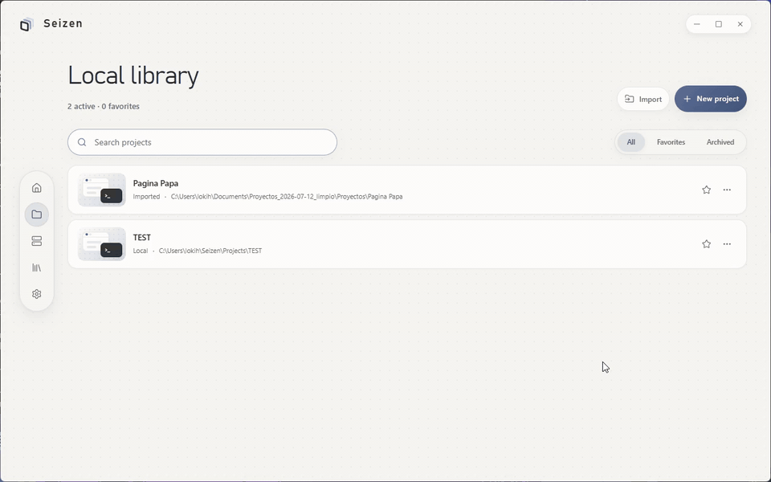
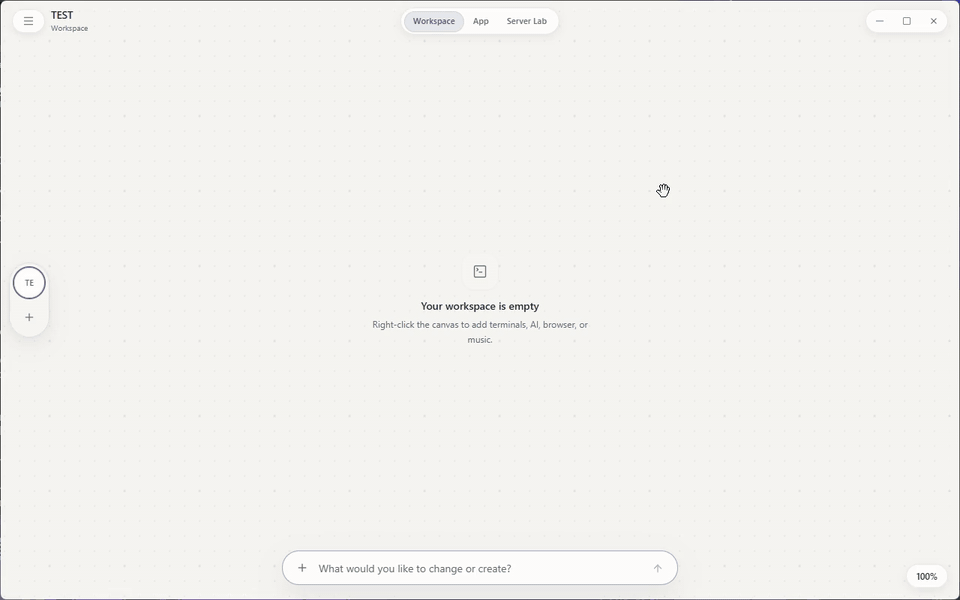
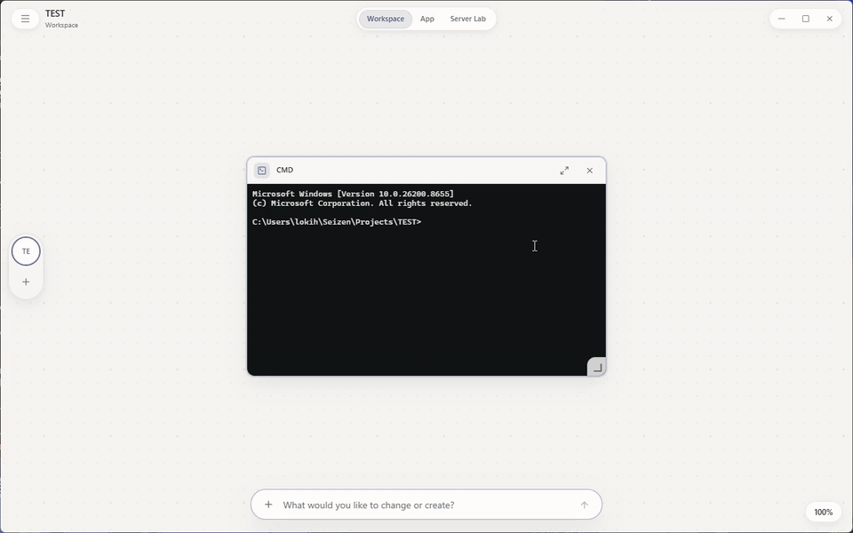

# Seizen

Desktop app for organizing projects. Each project gets a workspace canvas
where terminals, AI agents (Claude Code, Codex, OpenCode), code editors, a
browser, and tools live as movable panels. Built with Wails (Go) and React
rendered in the native WebView.

## Demo

Open a project from the local library:



Right-click the canvas to add AI agents and terminals:



Embedded browser alongside your terminals:



Manage editors, AI agents, and WSL environments from Resources:


## Development

Requirements: Go 1.25+, Node.js, and Wails 2.13.

```powershell
go install github.com/wailsapp/wails/v2/cmd/wails@v2.13.0
wails dev
```

Seizen creates a local SQLite database at `%APPDATA%\Seizen\seizen.db`. New
projects and cloned repositories are stored by default under
`~/Seizen/Projects`.

To build the Windows executable:

```powershell
wails build -clean
```

The result lands in `build/bin/Seizen.exe`.

## Structure

```
main.go          Wails entry point; embeds frontend/dist and calls core.Run
internal/core/   All application code: one Go package, files grouped by
                 prefix (agent_*, app_*, editor_*, experiment_*, server_*,
                 terminal_*, workspace_*, wsl_*) with tests alongside
frontend/        React + Vite UI (src/features, src/components)
build/           Wails packaging assets (icons, installer, manifest)
skills/          Agent skills shipped with the app
infra/           Coder-on-Incus workspace template (optional)
```
