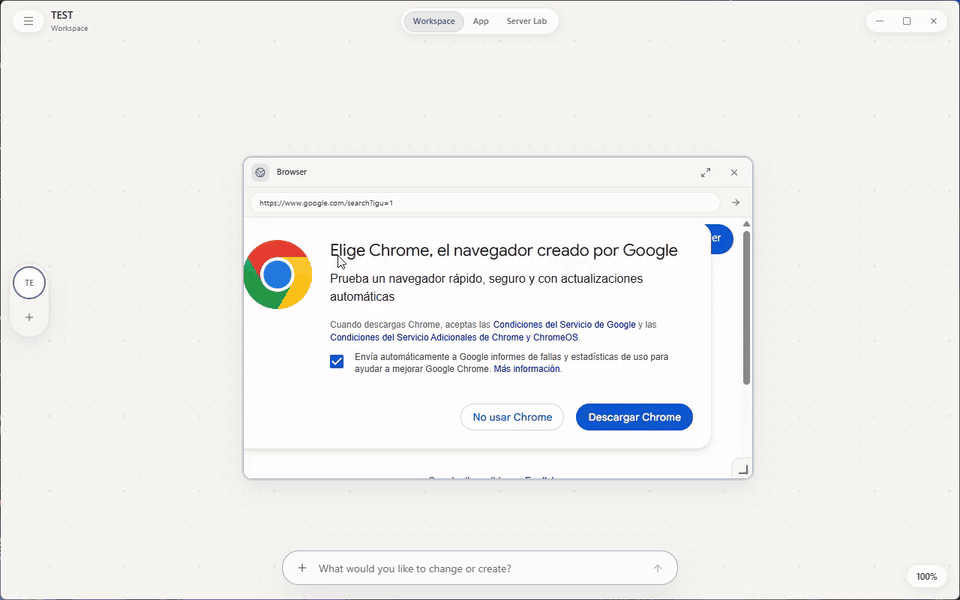

<div align="center">


# Seizen

### Your projects, your agents, your tools — one canvas. A desktop workspace where AI terminals, code editors, and browsers live together as movable panels.


</div>

<div align="center">
  
</div>

---

## What is it?

Seizen is a desktop app that turns every project into a **workspace canvas**. Right-click the canvas and drop in what that project needs: Claude Code, Codex, or OpenCode running in real WSL terminals, VS Code or Zed embedded as panels, a browser, your music. Everything stays where you left it — per project.

No window juggling. Open a project and its whole working environment comes back with it.

---

## Features

Everything below is captured from the real, compiled app — no mockups.

### One canvas per project
Enter a project and build its workspace: AI agents, editors, and terminals as panels you drag, resize, and arrange like windows on a desk.

<div align="center"></div>

### Switch projects, keep everything
Each project remembers its own panels. Jump from one to another and the whole environment swaps with it — here, one project runs Claude, Codex, and VS Code while the other keeps Zed and Spotify.

<div align="center"></div>

### Agents, editors, and environments in one place
Manage where each AI agent runs (per-agent WSL distribution or Windows), whether it can skip approvals, and which editors and WSL environments Seizen installs and manages for you.

<div align="center"></div>

---

## How it's built

- **[Wails](https://wails.io)** (Go) — native Windows shell; React renders in the system WebView, no browser bundled
- **Real agent terminals** — Claude Code, Codex, and OpenCode run in managed WSL 2 distributions (or Windows CMD) with per-project profiles and an MCP bridge into Seizen's tools
- **Native editor embedding** — Zed and other native editors are re-parented into the canvas via Win32 and pinned to their panel
- **Local-first** — a single SQLite database in `%APPDATA%\Seizen`; projects stay plain folders on disk

---

## Development

Requirements: Go 1.25+, Node.js, and Wails 2.13.

```powershell
go install github.com/wailsapp/wails/v2/cmd/wails@v2.13.0
wails dev
```

To build the Windows executable:

```powershell
wails build -clean
```

The result lands in `build/bin/Seizen.exe`.

### Repository layout

```
main.go          Wails entry point; embeds frontend/dist and calls core.Run
internal/core/   All application code (one Go package) and SQL migrations
frontend/        React + Vite UI
build/           Packaging assets (icon, installer, manifest)
skills/          Agent skills shipped with the app
infra/           Coder-on-Incus workspace template (optional)
```

## License

Seizen is licensed under [CC BY-NC-SA 4.0](https://creativecommons.org/licenses/by-nc-sa/4.0/) (Attribution-NonCommercial-ShareAlike).

- **Attribution** — you must give credit to the original author ([FaridDevU](https://github.com/FaridDevU)).
- **NonCommercial** — you may not use this project for commercial purposes.
- **ShareAlike** — if you remix or build upon it, you must distribute your contributions under the same license.

See [LICENSE](LICENSE) for the full text. For commercial licensing, contact the author.
